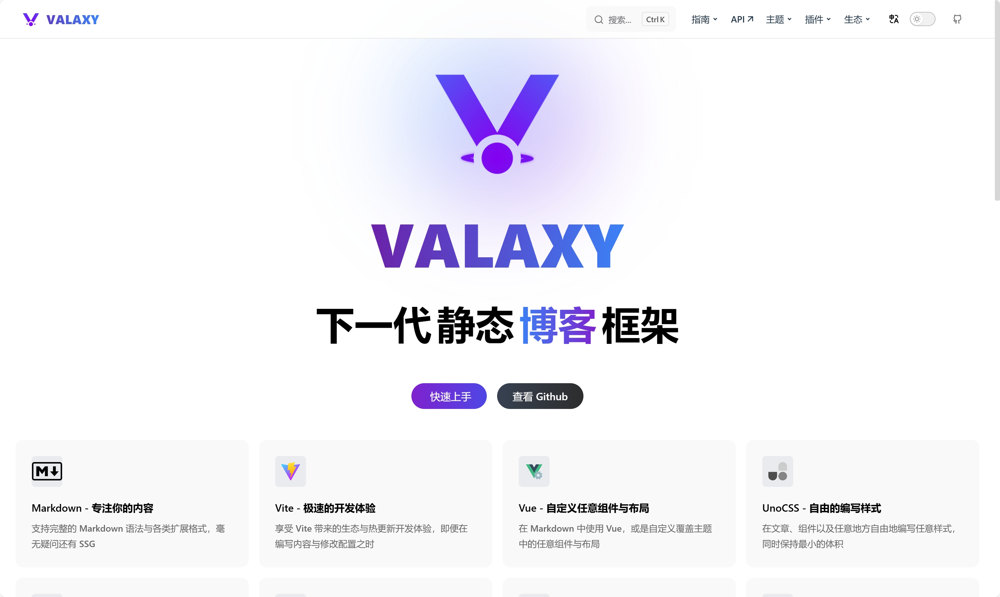

> 本文将教你如何零成本创建一个专属于你的博客！

## 为什么要创建一个博客？

在这个信息爆炸的时代，我们每天都会接触到大量的信息，有时候我们会看到一些有趣的文章，有时候我们会有一些自己的想法，但是这些信息和想法都会在我们的大脑中消失，我们没有办法将这些信息和想法记录下来，也没有办法和别人分享。而创建一个博客，就可以让我们将这些信息和想法记录下来，分享给别人，也可以让我们和别人交流，让我们的思想得到更多的反馈。

## 我们要使用的平台！

### [Vercel](https://vercel.com/)

Vercel 是一个全球领先的 `Serverless` 部署平台，它可以帮助我们快速部署我们的网站，并且提供了很多强大的功能，比如自动部署、自动缓存、自动压缩等等。

最重要的是，他为免费用户提供每个月`100GB`的流量，这对于一个小型博客来说是绰绰有余的，同时提供免费的`自定义域名`和`SSL证书签发`。

类似的，我们可以使用`Github Pages`、`Netlify`等平台，但是Vercel是我个人最喜欢的一个。

不过值得注意的是Vercel在部分地区部分运营商存在DNS问题，如果你在使用过程中遇到了问题，可以尝试使用其他平台。

如果你拥有Azure的学生订阅，你也可以使用`Azure Static Web Apps`，它也是一个很好的选择。他可以自己选择地域（可选香港 East Aisa），并且和Vercel一样的免费额度和功能！最重要的是他不会被DNS污染！

### [Valaxy](https://valaxy.site/)

Valaxy 是一个免费的博客主题，它提供了很多强大的功能，比如`SEO优化`、`自适应`、`代码高亮`、`评论系统`等等。
