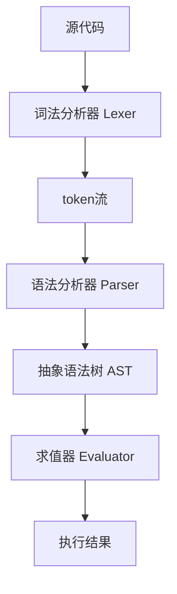
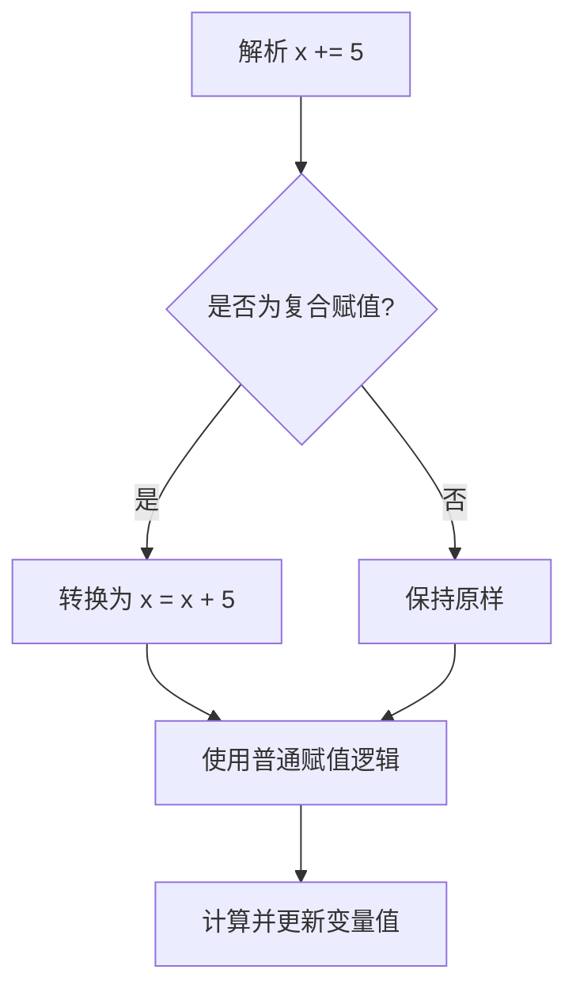
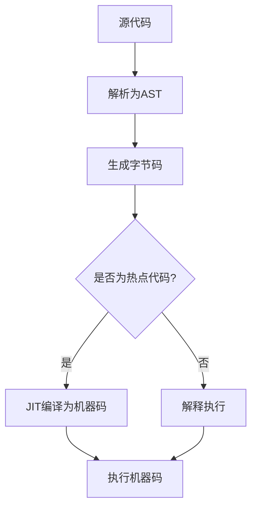

## 灵感的火花

首先，我要向Thorsten Ball致敬。是他的《用Go语言自制解释器》这本书点燃了我的灵感之火。读完这本书后，我想："嘿，为什么不自己也来一次呢？"于是，1y-Language项目就这样诞生了。

但是，我可不想只是简单地照搬书中的例子。我心想："既然要做，那就要与众不同！"所以，我在原版的基础上添加了一些新的关键字和特性，力求让1y-Language更贴近现代编程语言的特点。这个过程就像是给一辆经典老爷车装上了喷气引擎 —— 既复古又前卫！

如果你对我的编程语言感兴趣，你可以访问我的Repo：[1y-Language](https://github.com/1y-Language/core)

## 1y-Language的整体结构

和众多解释器的结构类似，1y-Language的整体架构包括词法分析器、语法分析器、求值器等组件。这些组件相互协作，将源代码转换为最终的执行结果。



## 我使用Go的100种理由

选择Go语言来实现这个项目可以说是一拍即合。Go语言简洁高效的特性，使得构建解释器的过程变得异常顺畅。有时候我甚至觉得，Go语言就像是为了创建解释器而生的！

欸，真有这么多理由吗？（难道不是因为这不是就是使用的Go语言的书吗？）

不过，在一开始尝试制作解释器方面，我确实陷入了一个“效率和性能”的思考中。我一开始想着是否要和Python一样使用C语言来实现解释器，但作为解释器初学者，一口气吃成一个胖子很显然是不好的，太过追求效率和成果，反而会打击自己的积极性。所以，我选择了Go语言，因为它的简洁性和高效性，让我可以专注于解释器的设计和实现，而不用过多地担心底层细节。

（放x！你明明是馋Go的交叉编译能力和高效GC，这样你就不用自己实现一套GC了！）

谁？！谁在说话？

## 复合赋值运算符：我的头号劲敌

说到`+=`、`-=`这些复合赋值运算符，我不得不说这是我在整个项目中遇到的最大挑战之一。起初，我天真地以为这会很简单，结果却在这里栽了个大跟头。

我最初的实现可以正常计算结果，但就是无法正确地赋值回变量。比如`x += 5`可以计算出正确的结果，但`x`的值却没有更新。这个问题让我连续几个日夜都睡不好觉，我的头发可能都白了几根！

最后，灵感突然降临。我意识到我可以利用已经实现的中缀表达式语法来解决这个问题。处理过程大概是这样的：



这个方法完美地解决了问题！现在，每当解析器遇到复合赋值运算符时，它会自动将其转换为等价的普通赋值表达式。这样一来，我就可以复用已有的赋值和计算逻辑，而不需要为复合赋值单独写一套逻辑。

实现这个功能后，我不禁感叹：有时候，最简单的解决方案往往是最后才想到的！

## 循环结构：for和while的实现

在1y-Language中，我添加了`for`和`while`循环，使得语言的流程控制更加完整和灵活。

### for循环

for循环的实现支持了标准的三部分语法：初始化、条件和迭代。例如：

```
for (let i = 0; i < 10; i++) {
    puts(i);
}
```

实现for循环时，最大的挑战是要处理好块级作用域。在每次迭代开始时，都需要创建一个新的作用域，以确保变量在正确的作用域中解析。

### while循环

while循环相对简单一些，但同样重要：

```
let x = 0;
while (x < 5) {
    puts(x);
    x++;
}
```

实现while循环时，关键是要确保条件检查在每次迭代开始时进行。

## 变量作用域：块级作用域的实现

在设计1y-Language时，我决定实现块级作用域，这使得语言更加现代和灵活。这意味着在任何块（比如函数体、if语句、循环等）中声明的变量，其作用域仅限于该块。

实现这一特性的关键在于使用了一个作用域栈。每当进入一个新的块时，就会创建一个新的作用域并推入栈顶。离开块时，相应的作用域会被弹出。

例如：

```
let x = 10;
{
    let x = 20;
    puts(x);  // 输出 20
}
puts(x);  // 输出 10
```

这个特性的实现充满了挑战，特别是在处理闭包时。确保变量在正确的作用域中被解析和修改，是实现这个特性时最棘手的部分。

## 巧妙的"抄袭"：从Python和C#汲取灵感

在设计1y-Language时，我并不羞于向其他优秀的编程语言学习。毕竟，好的想法值得被传播和使用。让我向你介绍两个我特别喜欢的"抄袭"案例：

### Python风格的快速浮点数创建

从Python那里，我借鉴了一个非常简洁的浮点数表示方法。在1y-Language中，你可以这样快速创建一个浮点数：

```
>> .9
0.9
```

这种语法糖让代码更加简洁易读。不需要显式地写成`0.9`，直接用`.9`就可以表示这个浮点数。这个特性在处理大量小于1的浮点数时特别有用。

实现这个功能时，我不得不修改词法分析器，让它能正确识别这种特殊的数字表示方法。虽然增加了一些复杂性，但是为了更好的用户体验，这点付出绝对值得！

### C#风格的多维数组访问

另一个我非常喜欢的特性是借鉴自C#的多维数组访问语法。在1y-Language中，你可以这样访问多维数组的元素：

```
arr[1,2]  // 等价于 arr[1][2]
```

这种语法不仅更加简洁，而且在处理多维数组时更加直观。实现这个功能时，我需要在语法分析器中添加对这种特殊索引表达式的支持，并在求值器中正确解释这种表达式。

这个特性的一个有趣之处是，它实际上可以与传统的数组访问方式共存。也就是说，`arr[1][2]`和`arr[1,2]`在1y-Language中都是有效的，并且效果相同。这给了程序员更多的灵活性，可以根据个人喜好选择使用哪种语法。

### 融会贯通的艺术

这些"抄袭"的特性展示了1y-Language的一个重要设计理念：汲取精华，融会贯通。通过借鉴不同语言的优秀特性，1y-Language力求在保持简单性的同时，为用户提供强大而灵活的编程工具。

实现这些特性的过程充满了挑战，但也带来了许多乐趣。每次看到这些熟悉而又略有不同的语法在1y-Language中成功运行时，我都会感到一种特别的成就感。这就像是在编程语言的海洋中探索，发现宝藏，然后将它们组合成一件全新的艺术品。

这种"抄袭"不仅使1y-Language更加强大，也让已经熟悉其他语言的程序员能够更快地上手。毕竟，在编程的世界里，熟悉感有时候比完全的创新更受欢迎，特别是对于那些需要快速切换between不同语言的开发者来说。

## 模块化和导入功能：代码重用的艺术

在开发1y-Language的过程中，我意识到模块化和代码重用的重要性。因此，我决定实现一个强大的import功能，允许开发者引入其他`.1y`文件中的代码。这不仅提高了代码的可维护性，还大大增强了语言的扩展性。

实现import功能的过程充满了挑战。我需要考虑文件路径解析、循环导入预防、命名空间管理等诸多问题。但是，当我看到第一个成功的import语句运行时，那种成就感是无法形容的！

来看看1y-Language中的import语句是如何工作的：

```
const math = import("math.1y")

let result = math.sqrt(16)
puts(result)  // 输出: 4
```

在这个例子中，我们导入了一个名为`math.1y`的文件，然后使用了其中定义的`sqrt`函数。这个看似简单的功能，背后却是复杂的文件读取、解析和环境管理机制。

实现import功能后，1y-Language的生态系统立即丰富了起来。用户可以创建自己的库，分享代码变得异常简单。这让我不禁畅想：也许有一天，我们会看到一个繁荣的1y-Language包管理生态系统？谁知道呢！

## 1y-Language的特色功能

经过不懈努力，1y-Language终于有了一些引以为豪的特性：

1. 支持整数、浮点数、字符串等基本数据类型
2. 实现了变量声明、函数定义、条件语句等基本语言结构
3. 支持数组和哈希表等复杂数据结构
4. 实现了一些花哨的运算符，比如幂运算(**), 位运算(&, |, ^, ~, >>, <<)等
5. 支持科学计数法(比如1e9)，让你在处理天文数字时不再头疼
6. 复合赋值运算符（+=, -=, *=, /= 等）
7. 自增自减运算符（++ 和 --）
8. 模块化导入功能，支持导入其他`.1y`文件
9. 函数式编程特性，如高阶函数、闭包等

让我们看一个1y-Language的代码示例：

```
const mathutils = import("mathutils.1y")

let x = 5.0e2;  // 科学记数法
let y = 3;
x += y;  // 复合赋值
y++;     // 自增
let z = x & y;  // 位运算
let result = mathutils.power(x, 2);  // 使用导入的函数
puts(x, y, z, result);
```

是不是感觉很现代，很酷炫？每一个特性的实现都让我兴奋不已，尤其是那些困扰了我好几天的功能（没错，我说的就是你，复合赋值运算符和import功能！）。

## 未来的野心：JIT编译器

但我的野心不止于此。下一步，我打算为1y-Language加入即时编译（JIT）功能。没错，我要给这辆"老爷车"装上火箭推进器！

我已经开始着手设计虚拟机和字节码了。这是我目前构想的JIT编译流程：



想象一下，有一天1y-Language能运行得比C语言还快，那该多酷啊！（好吧，我承认这有点夸张）

## 结语

创建1y-Language的过程就像是一次编程语言的探险之旅。有欢笑，有泪水，还有无数个对着屏幕疑惑"为什么会这样？"的夜晚。但每一个成功解决的bug，每一个新实现的功能，都让我感到无比的成就感。

如果你也对编程语言设计感兴趣，我强烈建议你试试看。相信我，这绝对是一段难忘的经历！

至于1y-Language的未来会如何？谁知道呢。也许有一天，它会成为下一个Go语言。又或者，它会永远停留在我的GitHub仓库里，成为我编程生涯中一段美好的回忆。